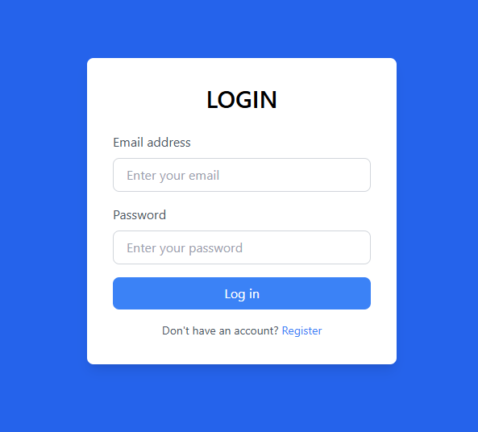
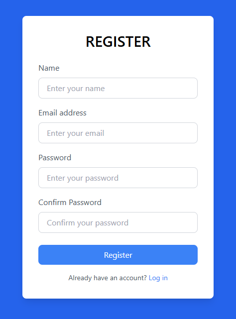
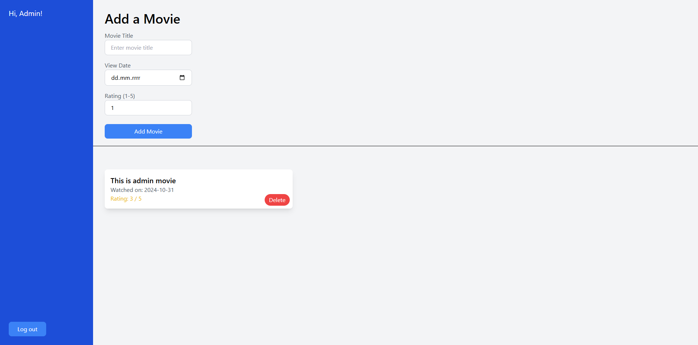

# LogReg
Login Register Movies add/delete
---

## **Info**

- **Main assumption**: A simple mechanism using express as server and react as frontend to store a collection of movies
- **Test logins available**:  
 email: Admin@gmail.com, password: Admin123, name: Admin  
 email: test@gmail.com, password: 123, name: Alex
- **Test videos available**: 1 for admin, 1 for alex

 

  
- **ONE PAGE SITE**: this page is one page without a router and the ability to refresh the page, because it kicks back the user to the login panel
- **Login**: You can log in with one of the test logins or create a new account
- **Register**: By registering you create an account in the “database” (there's no database it's variable, which stores data). Only one email can be set up per account!
- **Add / Delete movies**: Logged in user can see his own collection of movies and can add or delete them
- **Logout**: When you log off, you don't lose your collection, you can switch accounts
 
  
- **GIT**: GIT in use
 
 
  
- **Deeper info**: server > src > data > data.mjs for users and movies lists
---

 
 

